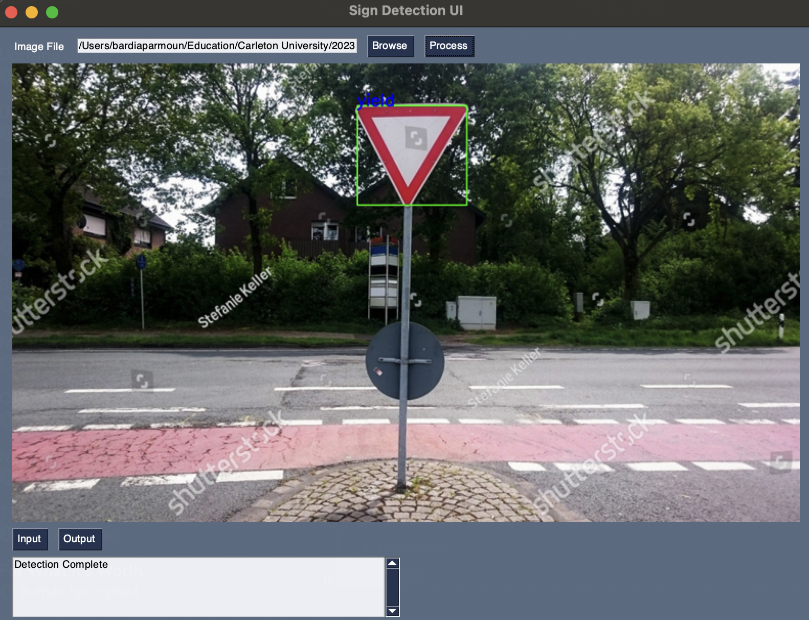
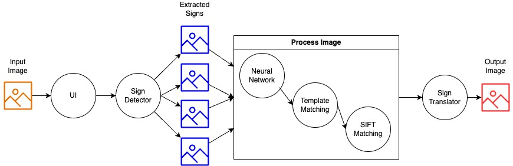

# Traffic Sign Detection and Recognition

This project detects and recognizes traffic signs in images using computer vision and deep learning techniques. It combines various methods, including a neural network, template matching, and SIFT (Scale-Invariant Feature Transform) for sign recognition.



## Demo

Make sure to checkout a demo of our project [here](demo/demo.mp4)!
## Requirements

- Python 3.6 or higher
- pip (Python package manager)

## Setup

1. Ensure Python and pip are installed on your system. If not, download and install Python from the official website. This will typically include pip.

2. Install the required Python packages:
```bash
pip install -r requirements.txt
```


## Usage

### Command Line

To process an image and detect traffic signs, run:
```bash
python main.py
```


This will process the `input/test.jpg` image and save the results in the `results` directory.

### User Interface

You can also use the provided graphical user interface (GUI) to interact with the project:
```bash
python ui.py
```

The GUI allows you to select an image, process it, and view the detected signs and their classifications.

## Design
Here is a quick overview of the components of the system:


### Project Structure

- `main.py`: Main script for processing images. It includes functions for loading images, detecting traffic signs, and saving results.
- `ui.py`: User interface script that provides a graphical interface for interacting with the project. Users can select an image, process it, and view the results.
- `sign_detection/`: This directory contains the sign detection module, which includes algorithms for detecting traffic signs in images.
- `neural_network/`: Contains the neural network module for sign classification. This module uses deep learning models to classify the detected signs.
- `template_match/`: Includes the template matching module for sign recognition. This module compares detected signs against a database of known signs to recognize them.
- `sign_translation/`: This module is responsible for mapping sign IDs to their corresponding names or descriptions.
- `evaluation/`: Contains evaluation scripts and test data for assessing the performance of the detection and recognition models. This includes metrics such as precision, recall, and accuracy, which help in understanding the effectiveness of the models in correctly identifying and classifying traffic signs.
- `input/`: Directory for input images.
- `results/`: Directory for saving processed images and results. This includes detected signs and their classifications.

For further understanding the design of the project, make sure to checkout the [documents](documents/) folder.

## Evaluation

The `evaluation/evaluation.py` script provides functionality to evaluate the performance of the detection and recognition models. It includes metrics such as precision, recall, and accuracy for both detection and recognition tasks.

To run the evaluation, execute the following command:
```bash
python -m evaluation.evaluation 
```


This will evaluate the models using the provided test suite and print the results to the console.


## Contributors

- Bardia Parmoun
- Liam Gaudet
- Siddharth Natamai